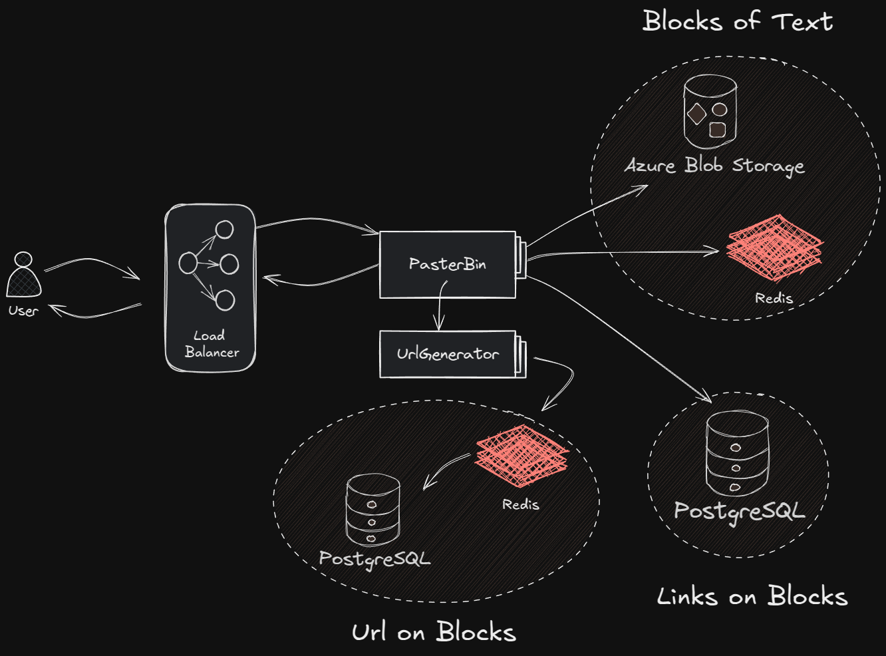

# **PasterBin – Web Application for Storing and Sharing Text Blocks**  



**PasterBin** is a high-performance web application designed for storing, sharing, and managing text blocks. It supports the generation of unique URLs, uses **Redis Cloud** for caching, and stores text in **Azure Blob Storage**. The application is built with a **microservices architecture**, ensuring reliability and scalability.

---

## **Features**  
✅ **Create, edit, and delete text blocks**  
✅ **Generate unique URLs for quick text access**  
✅ **Cache data in Redis Cloud for instant retrieval**  
✅ **Store text data in Azure Blob Storage**  
✅ **Delete data upon user request**  
✅ **Load balancing for efficient request distribution**  

---

## **Tech Stack**  

### **Back-end**  
- **Java 21**  
- **Maven**  
- **Spring Boot**  
- **Spring Data JPA**  
- **PostgreSQL** (for metadata storage)  
- **Redis Cloud** (for caching URLs)  
- **Azure Blob Storage** (for storing text blocks)  
- **RestTemplate** (for inter-service communication)  

---

## **Microservices**  
🔹 **Pasterbin** – Handles user requests, manages text storage, interacts with the database, cache, and storage.  
🔹 **UrlGenerator** – Generates unique hashes (identifiers) for text blocks.  

---

## **Future Plans**  
🔹 **Add support for uploading images, videos, and documents**, allowing users to store and share more than just text.  
🔹 **Develop a user service**, enabling registration, authentication, and management of stored data.  
🔹 **Implement a post feed**, allowing users to browse recently uploaded public text blocks.  

---

## **Setup & Deployment**  

### **1. Start All Services with Docker Compose**  
The application runs entirely in containers, **automatically deploying all services** (PostgreSQL, Redis Cloud, API services, and load balancer).  

To start the system, run:  
```bash
docker-compose up -d
```

